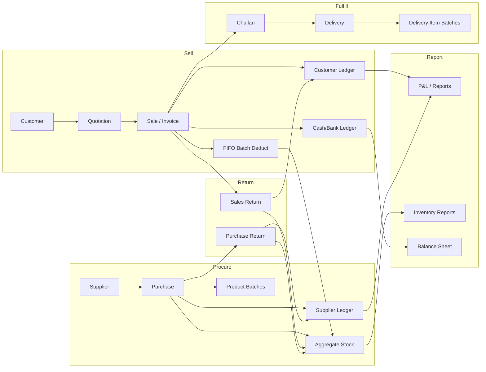

# SaniTiles ERP — Current System Audit

**Repository:** `tiles-sanitary-software-cdbb189b`  
**Audit date:** 2026-06-08  
**Branch audited:** `main` (production baseline)  
**Scope:** Full inventory of modules, pages, database entities, APIs, reports, workflows, gaps, and improvement recommendations for Bangladesh Tiles & Sanitary dealers.

---

## Executive Summary

SaniTiles ERP is a **multi-tenant SaaS** (dealer = tenant) built as a React SPA + Express/PostgreSQL VPS API, with Supabase used for customer portal auth and some super-admin CMS features. The system covers a **broad surface area** — core inventory/sales/purchase, batch FIFO, quotations, deliveries, HRM/payroll, financial statements, 60+ operational reports, and a customer portal.

**Strengths:** Atomic purchase and sale transactions with batch allocation, rich reporting, tile-specific units (`box_sft`, `per_box_sft`), challan workflow, dealer pricing tiers, CRM/leads, and a mature role model.

**Critical weak points:** Inconsistent ledger sign conventions across payment paths, returns that skip batch restoration, split VPS/Supabase payment updates, supplier payable report formula conflicts, no VAT/Mushak compliance, warehouse inventory not fully wired to sales/purchases, and financial reporting bugs (COGS unit mismatch on tile products — addressed in open PR stack, not yet on `main`).

---

## 1. Existing Modules

### 1.1 Platform & Multi-Tenancy

| Module | Backend routes | Frontend pages | Purpose |
|--------|---------------|----------------|---------|
| Authentication | `/api/auth/*` | `/login` | JWT access/refresh, password reset, login lockout |
| Dealers (tenants) | `/api/dealers/*` | Super Admin → Dealers | Tenant onboarding, approval, suspend |
| Subscriptions | `/api/subscriptions/*`, `/api/subscription/*`, `/api/plans/*` | `/subscription`, SA pages | SaaS billing, plans, payments |
| Team / RBAC | `/api/team/*` | `/settings/roles` | User management, roles |
| Settings | `/api/smtp-settings`, `/api/notifications/*` | `/settings`, `/settings/*` | SMTP, branches, notices, pricing tiers, backup |
| Super Admin | `/api/admin/*`, `/api/backups/*`, `/api/google-drive/*` | `/super-admin/*` | Platform ops, CMS, revenue, backups |
| Audit | `/api/audit-logs/*` | — | Immutable action log |
| Demo mode | `demoReadOnly` middleware | — | Read-only demo tenants |

**Roles:** `super_admin`, `dealer_admin`, `manager`, `accountant`, `salesman`  
**Middleware:** `authenticate`, `tenantGuard`, `requireRole`, `demoReadOnly`

---

### 1.2 Product & Inventory

| Module | Backend | Frontend | DB entities |
|--------|---------|----------|-------------|
| Products | `/api/products/*` (18 endpoints) | `/products`, `/products/new`, `/products/:id/edit` | `products` |
| Stock (read) | `/api/stock/*` | Embedded in products/reports | `stock` |
| Batches | `/api/batches/*` | Reports → Batch Tracking | `product_batches`, `sale_item_batches`, `delivery_item_batches` |
| Stock adjustments | `/api/adjustments/*` | `/damage` (broken stock) | `stock_ledger`, `audit_logs` |
| Display & samples | `/api/display-stock/*`, `/api/sample-issues/*` | `/display-sample` | `display_stock`, `sample_issues`, `display_movements` |
| Reservations | `/api/reservations/*` | Reports | `stock_reservations` |
| Warehouses | `/api/warehouses/*` | `/warehouses` | `warehouses`, `warehouse_transfers` |
| Imports | `/api/imports/*` | Settings / product import | — |
| Uploads | `/api/uploads/*` | Product images | — |

**Tile domain support:** `unit_type` = `box_sft` | `piece`; `per_box_sft`, shade/caliber/lot on batches; SQFT transactional columns on sale/purchase items.

---

### 1.3 Purchase & Supply Chain

| Module | Backend | Frontend | DB entities |
|--------|---------|----------|-------------|
| Suppliers | `/api/suppliers/*` | `/suppliers/*` | `suppliers`, `supplier_notes` |
| Purchases | `/api/purchases/*` | `/purchases/*` | `purchases`, `purchase_items`, `purchase_drafts`, `purchase_draft_items` |
| Purchase returns | `/api/returns/purchases` | `/purchase-returns/*` | `purchase_returns`, `purchase_return_items` |
| Auto-PO | `/api/auto-po/*` | `/purchases/auto-draft` | Auto-PO draft tables |
| Purchase planning | `/api/purchase-planning/*` | Reports → Purchase Planning | `purchase_shortage_links` |
| Demand planning | `/api/demand-planning/*`, `/api/demand-planning-settings/*` | Reports → Demand Planning | `demand_planning_settings` |
| Supplier performance | `/api/reports/supplier-performance/*` | Reports | — |

---

### 1.4 Sales & Fulfillment

| Module | Backend | Frontend | DB entities |
|--------|---------|----------|-------------|
| Customers | `/api/customers/*` | `/customers/*` | `customers` |
| Leads / CRM | `/api/leads/*` | `/leads/*` | `leads`, `lead_visits`, `lead_options` |
| Quotations | `/api/quotations/*` | `/quotations/*` | `quotations`, `quotation_items` |
| Sales | `/api/sales/*` | `/sales/*`, `/sales/pos` | `sales`, `sale_items`, `invoice_sequences` |
| POS | Same as sales | `/sales/pos` (no sidebar) | — |
| Challans | `/api/challans/*` | `/challans/*` | `challans` |
| Deliveries | `/api/deliveries/*` | `/deliveries` | `deliveries`, `delivery_items` |
| Sales returns | `/api/returns/sales` | `/sales-returns/*` | `sales_returns` |
| Backorders | `/api/backorders/*` | Reports | `backorder_allocations` |
| Pricing tiers | `/api/pricing-tiers/*` | `/settings/pricing-tiers` | `price_tiers`, `price_tier_items` |
| Commissions / referrals | `/api/commissions/*` | `/referrals` | `referral_sources`, `sale_commissions` |
| Campaign gifts | `/api/campaign-gifts/*` | `/campaigns` | `campaign_gifts` |
| Projects | `/api/projects/*` | `/projects` | `projects`, `project_sites`, `project_code_sequences` |
| Approvals | `/api/approvals/*` | `/approvals` | `approval_requests`, `approval_settings` |

---

### 1.5 Finance & Accounting

| Module | Backend | Frontend | DB entities |
|--------|---------|----------|-------------|
| Customer ledger | `/api/ledger/customers/*` | `/ledger` | `customer_ledger` |
| Supplier ledger | `/api/ledger/suppliers/*` | `/ledger` | `supplier_ledger` |
| Cash ledger | `/api/ledger/cash/*` | `/ledger`, `/cashbook` | `cash_ledger` |
| Expense ledger | `/api/ledger/expenses/*`, `/api/expenses/*` | `/ledger` | `expense_ledger`, `expenses` |
| Bank accounts | `/api/bank-accounts/*` | `/bank-accounts/*` | `bank_accounts`, `bank_ledger` |
| Cashbook | `/api/cashbook` | `/cashbook` | Aggregated cash + bank |
| Day-end closing | `/api/cash-closings/*` | `/cash-closing` | `cash_closings` |
| Financial statements | `/api/financials/*` | `/financials` | Derived from ledgers + sales |
| Journal entries | `/api/journal/*` | `/journal` | `journal_entries`, `journal_entry_lines` |
| EMI plans | `/api/emi/*` | `/emi` | `emi_plans`, `emi_schedule` |
| Directors / equity | `/api/directors/*` | `/directors` | `directors`, `director_transactions` |
| Collections | `/api/collections/*` | `/collections` | Follow-ups + outstanding |
| Customer statements | `/api/customer-statements/*` | `/customers/statements`, `/:id/statement` | — |
| Credit control | `/api/credit/report` | `/reports/credit` | `credit_overrides` |

---

### 1.6 HRM & Payroll

| Module | Backend | Frontend | DB entities |
|--------|---------|----------|-------------|
| Employees | `/api/employees/*` | `/hrm` | `employees` |
| Salary structure | `/api/salary-components/*` | `/hrm/salary-structure` | `salary_structures`, `salary_components`, `employee_salary_components` |
| Payroll payments | `/api/employees/salary-payments` | `/hrm/payslip/:id` | `salary_payments` |
| Attendance | `/api/employees/attendance/*` | HRM page | `employee_attendance` |
| Advances | `/api/employees/advances/*` | HRM page | `salary_advances` |
| Leaves | `/api/leaves/*` | `/hrm/leaves` | `leave_types`, `leave_balances`, `leave_requests` |
| Holidays | `/api/holidays/*` | `/holidays` | `holidays` |
| Shifts | `/api/shifts/*` | `/hrm/shifts` | `shifts` |
| Performance | `/api/performance/*` | `/hrm/performance` | `performance_reviews`, `performance_kpis` |
| Training & skills | `/api/training/*` | `/hrm/training` | `skills`, `employee_skills`, `training_programs`, `training_enrollments` |
| Employee documents | `/api/employee-documents/*` | `/hrm/documents` | `employee_documents` |
| Employee loans | `/api/employee-loans/*` | `/hrm/loans` | `employee_loans`, `employee_loan_emis` |
| Exit / offboarding | `/api/employee-exits/*` | `/hrm/exits` | `employee_exits`, `employee_exit_clearances` |
| Assets | `/api/assets/*` | `/hrm/assets` | `assets`, `asset_assignments` |
| Branches | `/api/branches/*` | `/settings/branches` | `branches` |
| Notices | `/api/notices/*` | `/notices` | `notices` |

---

### 1.7 Communications & Operations

| Module | Backend | Frontend |
|--------|---------|----------|
| Dashboard | `/api/dashboard/*` | `/dashboard` |
| WhatsApp logs | `/api/whatsapp/*` | `/whatsapp-logs` |
| SMS | `/api/notifications/sms` | `/sms/single` |
| File manager | `/api/files/*` | `/files` |
| Data export | `/api/data-export/*` | Settings → Data Backup |
| User guide | — | `/user-guide` |

---

### 1.8 Customer Portal (Supabase-backed)

| Page | Route | Data source |
|------|-------|-------------|
| Portal login | `/portal/login` | Supabase auth + `portal_users` |
| Dashboard | `/portal/dashboard` | Supabase RPCs |
| Quotations | `/portal/quotations` | Supabase |
| Orders | `/portal/orders` | Supabase |
| Deliveries | `/portal/deliveries` | Supabase |
| Projects | `/portal/projects/*` | Supabase |
| Statement | `/portal/statement` | Supabase ledger RPCs |
| Requests | `/portal/requests` | Supabase |
| Documents | `/portal/quotation|invoice|challan/:id` | Supabase |
| Admin: portal users | `/admin/portal-users` | Supabase edge functions |
| Admin: portal requests | `/admin/portal-requests` | Supabase |

**Note:** Portal reads Supabase directly; core ERP mutations run on VPS API. This creates a **dual-stack architecture**.

---

### 1.9 Frontend Page Inventory (130 `.tsx` files, ~95 routes)

**Public:** Landing, pricing, privacy, terms, contact, get-started  
**Auth:** Login, subscription-blocked  
**ERP (AppLayout sidebar, 57 nav items):** All modules above  
**Super Admin (11 pages):** Dashboard, dealers, plans, subscriptions, revenue, payments, CMS, backups, system  
**Portal (12 pages):** Full customer self-service  
**Legacy (unrouted):** `AdminPage.tsx` and embedded admin components superseded by `/super-admin/*`

---

### 1.10 Backend API Inventory

| Metric | Count |
|--------|------:|
| Route modules (`backend/src/routes/*.ts`) | 76 |
| HTTP handlers (approx.) | ~520 |
| Knex migrations | 51 |
| Service layer files | 2 (`authService`, `notificationService`) |
| Shared lib helpers | 5 (`units`, `tileUnits`, `logger`, `safeSum`, `cogsLine` on PR branch) |

**Frontend services:** 65 files in `src/services/` calling VPS `/api/*` (portal uses Supabase separately).

---

### 1.11 Database Entities (~95+ tables)

#### Core / Auth / SaaS
`users`, `refresh_tokens`, `login_attempts`, `password_reset_tokens`, `dealers`, `profiles`, `user_roles`, `plans`, `subscription_plans`, `subscriptions`, `subscription_payments`, `contact_submissions`, `website_content`

#### Inventory & Sales
`customers`, `suppliers`, `products`, `stock`, `stock_ledger`, `sales`, `sale_items`, `purchases`, `purchase_items`, `purchase_drafts`, `challans`, `deliveries`, `delivery_items`, `delivery_item_batches`, `sales_returns`, `purchase_returns`, `purchase_return_items`, `invoice_sequences`, `product_batches`, `sale_item_batches`, `stock_reservations`, `display_stock`, `sample_issues`, `purchase_shortage_links`

#### Ledgers & Finance
`customer_ledger`, `supplier_ledger`, `cash_ledger`, `expense_ledger`, `expenses`, `bank_accounts`, `bank_ledger`, `journal_entries`, `journal_entry_lines`, `emi_plans`, `emi_schedule`, `credit_overrides`, `cash_closings`

#### CRM / Pricing / Projects
`projects`, `project_sites`, `project_code_sequences`, `price_tiers`, `price_tier_items`, `quotations`, `quotation_items`, `referral_sources`, `sale_commissions`, `leads`, `lead_visits`, `lead_options`, `customer_followups`, `campaign_gifts`

#### Operations
`approval_requests`, `approval_settings`, `demand_planning_settings`, `whatsapp_message_logs`, `whatsapp_settings`, `audit_logs`, `notifications`, `notification_settings`, `sms_message_logs`, `dealer_smtp_settings`, `backup_logs`, `restore_logs`, `google_drive_tokens`, `dealer_files`, `backorder_allocations`, `supplier_notes`, `purchase_draft_items`, `display_movements`

#### HRM / Payroll / Assets
`employees`, `salary_structures`, `salary_payments`, `salary_components`, `employee_salary_components`, `employee_attendance`, `salary_advances`, `directors`, `director_transactions`, `warehouses`, `warehouse_transfers`, `holidays`, `branches`, `notices`, `leave_types`, `leave_balances`, `leave_requests`, `shifts`, `performance_reviews`, `performance_kpis`, `skills`, `employee_skills`, `training_programs`, `training_enrollments`, `employee_documents`, `assets`, `asset_assignments`, `employee_loans`, `employee_loan_emis`, `employee_exits`, `employee_exit_clearances`

#### Portal (Supabase)
`portal_users`, `portal_requests`

**Schema tracks:** Knex migrations (`backend/src/db/migrations/`) for VPS; Supabase SQL migrations (`supabase/migrations/`, 138 files) for RLS/portal layer.

---

### 1.12 Reports Inventory (~70+ endpoints)

#### Financial Statements (`/api/financials`)
- Profit & Loss (`/p-and-l`)
- Balance Sheet (`/balance-sheet`)
- Trial Balance (`/trial-balance`)

#### Core Reports (`/api/reports`, 43 GET endpoints)

| Group | Endpoints |
|-------|-----------|
| Inventory | `/stock`, `/products`, `/brand-stock`, `/inventory-aging`, `/low-stock`, `/free-vs-reserved`, `/stock-movement` |
| Batch tracking | `/batches/stock`, `/mixed-sales`, `/aging`, `/movement` |
| Sales & revenue | `/sales`, `/retailer-sales`, `/product-history`, `/sales-by-salesman`, `/sale-overdue-check` |
| Receivables / payables | `/customer-due`, `/supplier-payable`, `/supplier-outstanding` |
| Reservations | `/reservations-active`, `/expiring`, `/by-customer`, `/by-batch` |
| Deliveries | `/pending-deliveries`, `/delivery-status` |
| Quotations | `/quotations/list`, `/conversion`, `/expired`, `/salesman`, `/top-products` |
| Approvals | `/approvals/history`, `/type-summary`, `/user-stats` |
| Full-page reports | `/page/daily-sales-calendar`, `/detailed-sales`, `/monthly-sales-grid`, `/customers-report`, `/monthly-summary`, `/purchases`, `/payments`, `/due-aging`, `/profit-analysis` |
| Accounting rollup | `/accounting-summary` |

#### Sub-report mounts
- `/api/reports/pricing-tier/*` (6) — tier usage, customer mapping, quoted vs sold
- `/api/reports/projects/*` (9) — project sales, outstanding, delivery history, pipeline
- `/api/reports/supplier-performance/*` (4) — supplier scorecards, price trends
- `/api/reports` phase3 (5) — salary history, director statement, warehouse stock, vouchers

#### Other report-like surfaces
- `/api/credit/report` — credit utilization
- `/api/customer-statements/:customerId` — printable customer statement
- `/api/collections/outstanding` — due tracker with aging
- `/api/dashboard/*` — 12 widget endpoints
- `/vouchers/salary/:id`, `/vouchers/director/:id` — printable vouchers

#### Frontend report hub (`/reports`)
17 collapsible groups with 60+ in-app report tabs in `ReportsPageContent.tsx`.

---

## 2. Current Workflow (Step-by-Step)

### 2.1 Purchase Workflow

```
Supplier selected → Purchase form (items, rates, transport/labor/other)
  → POST /api/purchases (atomic transaction)
    1. Validate RBAC (dealer_admin)
    2. Compute landed cost per line (tile: qty × per_box_sft × rate + extras)
    3. Insert purchases header + purchase_items
    4. Find-or-create product_batches (batch_no, shade, caliber, lot_no)
    5. Top-up batch quantity; link batch_id on purchase_item
    6. Update aggregate stock + weighted average cost (WAC on sft or piece)
    7. Insert stock_ledger (txn_type: purchase_in)
    8. FIFO backorder allocation on pending sale_items
    9. Insert supplier_ledger (type: purchase, amount: -netPayable)
   10. If paid_on_create > 0 → supplier_ledger payment + bank_ledger or cash_ledger
   11. audit_logs (purchase_create)
  → Commit → 201
```

**Key files:** `backend/src/routes/purchases.ts`  
**Gaps:** No purchase edit/delete/reversal. Standalone supplier payments only via generic ledger POST (no atomic cash/bank pairing).

---

### 2.2 Stock Workflow

Stock is **derived** from transactions, not independently authored.

| Event | Stock change | Batch-aware? | Ledger |
|-------|-------------|--------------|--------|
| Purchase create | ↑ aggregate + WAC | Yes — `product_batches` | `stock_ledger` purchase_in |
| Sale create | ↓ FIFO allocation | Yes — `allocate_sale_batches` RPC | `stock_ledger` sale_out |
| Sale edit/cancel | Restore batches | Yes — `restore_sale_batches` | Reversed |
| Sales return | ↑ aggregate only | **No** | — |
| Purchase return | ↓ aggregate only | **No** | — |
| Manual adjustment | ↑/↓ aggregate | **No** | `stock_ledger` adj_* |
| Reservation | Hold qty | Batch-level | — |
| Display/sample move | Separate `display_stock` | Partial | — |
| Warehouse transfer | Transfer between warehouses | Partial | Approval workflow |

**Read API:** `GET /api/stock` (no write endpoints).  
**Manual adjust:** `POST /api/adjustments/{add,deduct,restore,broken}`.

---

### 2.3 Sales Workflow

```
Customer (find/create) → Sale form (items, rates, payment, challan_mode?)
  → POST /api/sales (atomic transaction)
    1. Compute totals; COGS = Σ(effectiveQty × avgCost)  ← BUG on main for tiles
    2. generate_next_invoice_no RPC
    3. Insert sales + sale_items
    4. If NOT challan_mode:
       a. FIFO batch allocation per item (allocate_sale_batches)
       b. deduct_stock_unbatched fallback
       c. consume_reservation_for_sale (optional)
       d. stock_ledger sale_out
       e. customer_ledger: sale (+totalAmount)
       f. customer_ledger: payment (-paid_amount) if paid
       g. cash_ledger receipt if paid
    5. If challan_mode: skip stock + ledger in transaction
    6. audit_logs (sale_create)
  → Auto-create challan stub (outside tx)
  → 201
```

**Later payment paths (inconsistent):**
1. `POST /api/sales/:id/payment` — atomic (ledger + sale header update)
2. Invoice page — VPS ledger + **Supabase** sale header update
3. Collections tracker — ledger only, **does not update** `sales.paid_amount/due_amount`

**Edit:** `PUT /api/sales/:id` — restore batches, delete/recreate ledger entries.  
**Cancel:** `DELETE /api/sales/:id` — guards on delivery/payment.

**Key files:** `backend/src/routes/sales.ts`, `backend/src/routes/challans.ts`, `backend/src/routes/deliveries.ts`

---

### 2.4 Returns Workflow

#### Sales Return (`POST /api/returns/sales`)
```
Validate sale + qty caps
  → Insert sales_returns
  → If NOT is_broken: adjustAggregateStock (ADD) — aggregate only, no batch restore
  → Backorder cleanup on sale_item
  → customer_ledger refund (negative amount)
  → If cash refund: cash_ledger outflow
  → audit_logs
```

**Gaps:** No batch restoration, no COGS reversal in P&L, no update to `sales.paid_amount/due_amount`.

#### Purchase Return (`POST /api/returns/purchases`)
```
Insert purchase_returns + items
  → adjustAggregateStock (DEDUCT) — aggregate only
  → supplier_ledger refund (+amount)
  → cash_ledger refund (+amount) — always cash, no bank/credit-note path
  → audit_logs
```

**Key file:** `backend/src/routes/returns.ts`

---

### 2.5 Customer Due Workflow

**Ledger conventions (intended):**
| Event | customer_ledger type | Amount sign |
|-------|---------------------|-------------|
| Sale create | sale | +totalAmount |
| Payment at sale | payment | -paid_amount |
| Later payment (Collections) | payment | +amount |
| Sales return | refund | -refund_amount |

**Due computation surfaces (4 different formulas):**
1. `GET /api/ledger/customers/due-balance/:id` — type-based
2. `GET /api/collections/outstanding` — type-based + aging
3. `GET /api/reports/customer-due` — sign-based (amt ≥ 0 → debit)
4. `GET /api/reports/page/due-aging` — invoice-level `sales.due_amount`

**Broken link:** Collections payment does not sync invoice `due_amount`, causing report vs ledger drift.

---

### 2.6 Supplier Due Workflow

**Ledger conventions:**
| Event | supplier_ledger type | Amount sign |
|-------|---------------------|-------------|
| Purchase | purchase | -netPayable |
| Payment at purchase | payment | +paidOnCreate |
| Purchase return | refund | +totalAmount |

**Payable reports conflict:**
- `/api/reports/supplier-payable` — balance = credit − debit
- `/api/reports/supplier-outstanding` — outstanding = debit − credit

With purchases stored as negative amounts, these formulas can produce **opposite results**.

**Ad-hoc supplier payment:** `POST /api/ledger/suppliers` — no enforced cash/bank pairing.

---

### 2.7 Expenses Workflow

```
POST /api/expenses
  → Insert expenses row
  → expense_ledger (-amount)
  → cash_ledger type expense (-amount)
```

**Gaps:** Cash only (no bank), no audit_logs, no edit/delete.  
**Report:** `/api/reports/accounting-summary` rolls up monthly sales/purchases/expenses/cash.

---

### 2.8 Reports Workflow

```
User selects report in /reports hub
  → Frontend calls /api/reports/* or sub-mount
  → Backend queries with dealer_id filter + date range
  → Many reports gated by requireFinancialRole (dealer_admin)
  → Financial statements (/api/financials/*) aggregate ledgers + sales.cogs + returns
```

**Known P&L issues on `main`:**
- COGS sourced from `sale_items.quantity × cost_price` (column may not exist; silent zero)
- Sales returns valued at qty × rate instead of `refund_amount`
- Tile COGS stored as `boxes × ৳/sft` instead of `boxes × sft/box × ৳/sft`
- Silent `.catch(() => null)` swallows aggregation errors

*(Track 1 Phase 1 + 1A PRs address these; not merged to `main` at audit time.)*

---

### 2.9 End-to-End Business Flow Diagram



---

## 3. Missing Features

### 3.1 Critical (Blocks production trust)

| # | Feature | Current state |
|---|---------|---------------|
| 1 | Correct tile COGS calculation | Bug on `main`; fix in PR stack |
| 2 | Reliable P&L / financial statements | Multiple formula bugs on `main` |
| 3 | Unified customer payment path | 3 paths with inconsistent signs |
| 4 | Sales return batch restoration | Aggregate-only restock |
| 5 | Sales return COGS reversal | Not implemented |
| 6 | Purchase edit/delete/reversal | Not implemented |
| 7 | Supplier payable report consistency | Conflicting formulas |

### 3.2 Bangladesh Business Requirements

| # | Feature | Status |
|---|---------|--------|
| 1 | VAT / Mushak-6.3 / Mushak-6.6 tax invoice | Not implemented; challans disclaim tax status |
| 2 | NBR VAT reporting / Mushak ledger | Not found |
| 3 | BIN/TIN on printed invoices | Dealer has `tax_id`; not on sale/challan print |
| 4 | bKash / Nagad / Rocket payment reconciliation | Marketing copy only; manual `payment_mode` string |
| 5 | Bangla invoice/challan print | UI mostly English |
| 6 | Supplier BIN field | Uses `gstin` (Indian naming) |
| 7 | Withholding tax (TDS) | Not found |
| 8 | e-TIN / BIN validation | Storage only |

### 3.3 Operational Gaps

| # | Feature | Status |
|---|---------|--------|
| 1 | True warehouse-based inventory on sales/purchases | Warehouses exist; stock is dealer-level aggregate |
| 2 | Multi-branch stock isolation | Branches exist; not tied to inventory |
| 3 | Expense bank payment | Cash only |
| 4 | Purchase return credit note (non-cash) | Always hits cash |
| 5 | Rate unit pricing enforcement (`rate_unit` per sqft/box/piece) | Partial; inconsistent across modules |
| 6 | Barcode / POS scanner integration | Barcode field exists; no scanner workflow |
| 7 | Automated backup verification | Backups exist; restore testing manual |
| 8 | Integration tests with Postgres | Contract tests exist but `describe.skip` |
| 9 | API documentation for VPS routes | `docs/API_REFERENCE.md` covers auth only |
| 10 | Historical COGS backfill tool | Documented as Phase 1B; not built |

### 3.4 Nice-to-Have (Industry standard)

- GRN (Goods Receipt Note) separate from purchase invoice
- Landed cost allocation templates
- Customer credit scoring / auto-block
- Supplier PO approval workflow (Auto-PO drafts exist but limited)
- Serial number tracking for sanitary ware
- Transport/delivery cost billing to customer
- Multi-currency (import tiles)
- Inter-dealer stock transfer (distributor network)

---

## 4. Weak Points

### 4.1 Broken Workflow Links

| Issue | Severity | Evidence |
|-------|----------|----------|
| Customer payment sign split | **High** | Sale create uses negative payment; Collections uses positive |
| Collections don't update invoice due | **High** | `CollectionTracker.tsx` writes ledger only |
| Invoice payment split VPS/Supabase | **Medium** | `InvoicePage.tsx` updates sale header on Supabase |
| Returns skip batch layer | **Medium** | `returns.ts` aggregate-only restock |
| Challan mode defers stock/ledger | **Medium** | Must complete via deliveries/invoicing |
| Generic ledger POST allows orphan entries | **Medium** | `ledger.ts` — no atomic sale/cash sync |
| Portal dual-stack drift | **Medium** | Portal reads Supabase; ERP writes VPS |
| Purchase return always hits cash | **Medium** | No credit-note path |
| No purchase edit/delete | **Medium** | Explicitly deferred in code comments |

### 4.2 Duplicate Logic

| Pattern | Locations | Risk |
|---------|-----------|------|
| `resolveDealer(req, res)` | 30+ route files | Copy-paste drift |
| `requireAdmin(req, res)` | returns, expenses, adjustments, credit, etc. | Inconsistent RBAC |
| Stock aggregate adjust | `returns.ts`, `adjustments.ts`, inline in `sales.ts` | Three styles; only sales use batch RPCs |
| FIFO batch allocation | `sales.ts` POST vs PUT | PUT omits reservation honouring |
| Customer outstanding math | collections, credit, ledger, reports | Four variants |
| Supplier balance math | supplier-payable vs supplier-outstanding vs financials | Conflicting signs |
| Ledger + cash paired writes | sales, purchases, expenses, returns, frontend | No shared helper |
| Audit metadata capture | Duplicated `clientMeta` inline | Inconsistency |

### 4.3 Architecture Weak Points

1. **Thin service layer** — Business logic lives inline in route handlers (especially `sales.ts`, `purchases.ts`, `reports.ts`).
2. **Dual database stacks** — Knex/VPS for ERP mutations; Supabase for portal + some reads; risk of data drift.
3. **Stale code comments** — `sales.ts` and `stock.ts` still reference Supabase for mutations (outdated).
4. **Incomplete schema docs** — `DATABASE_SCHEMA.md` truncates at "remaining tables follow similar patterns."
5. **No integration test DB** — Financial contract tests skipped.
6. **Report sprawl** — 70+ endpoints with overlapping queries and inconsistent aggregation formulas.

### 4.4 Security & Compliance Notes

**Present:** JWT with refresh reuse detection, bcrypt, login lockout, Helmet, rate limiting, CORS allowlist, RBAC, audit_logs, demo read-only mode.

**Gaps:** No field-level encryption for PII, no VAT audit trail, no data retention policy documented, salesman can POST generic ledger entries.

---

## 5. Suggested Database Improvements

### 5.1 High Priority

| Change | Rationale |
|--------|-----------|
| Add `cogs_method` to `sales` | Distinguish legacy vs corrected COGS (PR 051) |
| Add `payment_source_id` + `payment_source_type` to all ledger tables | Link ledger entries to originating sale/purchase/return |
| Standardize ledger amount sign convention | Document and enforce: positive = debit to party, negative = credit |
| Add `warehouse_id` to `stock`, `product_batches`, `sale_items`, `purchase_items` | Enable true multi-warehouse inventory |
| Add `sales_returns.cogs_reversal` column | Track COGS impact of returns for P&L |
| Add batch restoration columns to `sales_returns` | `batch_id`, `qty_restored` for FIFO parity |
| Add `vat_rate`, `vat_amount`, `mushak_serial` to `sales`, `purchases` | Bangladesh tax compliance |
| Create `vat_ledger` table | Mushak reporting |

### 5.2 Medium Priority

| Change | Rationale |
|--------|-----------|
| Rename `suppliers.gstin` → `bin` or add `bin` column | Bangladesh terminology |
| Add `expenses.payment_account_id` (bank/cash) | Bank expense payments |
| Add `purchase_returns.payment_mode` | Credit note vs cash refund |
| Add `sales.paid_amount` sync trigger or computed view | Prevent invoice vs ledger drift |
| Index `(dealer_id, sale_date, cogs_method)` on sales | Legacy COGS detection performance |
| Materialized view `mv_customer_outstanding` | Single source for all due reports |
| Materialized view `mv_supplier_payable` | Single source for payable reports |
| Add `rate_unit` enum to `sale_items`, `purchase_items`, `quotation_items` | Enforce sqft/box/piece pricing |

### 5.3 Low Priority / Future

- `grn` / `grn_items` tables for goods receipt workflow
- `stock_transfers` with batch-level detail
- `price_history` for audit of rate changes
- `dealer_settings` JSON for per-tenant feature flags
- Partition `audit_logs` and `stock_ledger` by month for performance

---

## 6. Suggested UI Flow Improvements

### 6.1 High Priority

| Flow | Current pain | Suggested improvement |
|------|-------------|----------------------|
| Customer payment | 3 paths (sale create, invoice, collections) with different behavior | Single "Record Payment" flow always calling `POST /api/sales/:id/payment`; remove Supabase sale update from InvoicePage |
| Collections tracker | Ledger-only; invoice due not updated | After payment, show updated invoice due; require sale link |
| Sales return | No batch/shade selection | Return wizard: select sale → select items → select batch/shade to restock |
| Purchase | No edit after save | Add "Edit purchase" with reversal + re-post pattern (or void + recreate) |
| Financial statements | Silent errors, wrong COGS on main | Deploy Phase 1+1A; show data quality warnings prominently |
| Supplier payment | Generic ledger entry | Dedicated "Pay Supplier" form with bank/cash selection + purchase allocation |

### 6.2 Bangladesh Localization

| Item | Suggestion |
|------|------------|
| Invoice print | Add Bangla header/footer toggle; show dealer BIN, customer TIN |
| Mushak | New "Tax Invoice" document type separate from challan |
| Payment modes | bKash/Nagad/Rocket as first-class with transaction ID field |
| SMS templates | Bengali due reminders (partially exists) |
| Units display | Always show "box + sft" dual unit on tile lines |

### 6.3 Navigation & UX

| Item | Suggestion |
|------|------------|
| Sidebar (57 items) | Group into collapsible sections: Sales, Purchase, Inventory, Finance, HRM, Reports |
| Reports hub (60+ tabs) | Add search/filter; mark "financial" vs "operational" |
| POS | Add barcode scan; default warehouse; offline queue |
| Dashboard | Single "business health" widget: due total, stock value, today's sales, pending deliveries |
| Settings | Surface pricing tiers, roles, backup in sidebar or unified settings hub |
| Onboarding wizard | Already has `/dashboard/onboarding-counts` API — build first-run checklist UI |

### 6.4 Warehouse & Inventory UX

| Item | Suggestion |
|------|------------|
| Stock view | Show warehouse × batch × shade grid (not just aggregate) |
| Sale create | Warehouse selector per line; warn if insufficient batch qty |
| Purchase | Default warehouse destination |
| Transfer | Visual transfer request → approve → receive flow (API exists; UX polish) |

### 6.5 Portal Alignment

| Item | Suggestion |
|------|------------|
| Data source | Migrate portal reads to VPS API (eliminate Supabase drift) |
| Portal payments | Allow online payment request (not just view statement) |
| Portal orders | Real-time sync with ERP sale status |

---

## Appendix A: API Module Quick Reference

<details>
<summary>All 76 backend route modules</summary>

| Module | Mount | Handlers |
|--------|-------|--------:|
| auth | /api/auth | 9 |
| health | /api/health | 1 |
| dealers | /api/dealers | 11 |
| subscriptions | /api/subscriptions | 8 |
| plans | /api/plans | 5 |
| subscriptionStatus | /api/subscription | 5 |
| adminStats | /api/admin | 2 |
| backups | /api/backups | 9 |
| googleDrive | /api/google-drive | 5 |
| team | /api/team | 4 |
| customers | /api/customers | 5 |
| leads | /api/leads | 13 |
| collections | /api/collections | 4 |
| customerStatements | /api/customer-statements | 2 |
| credit | /api/credit | 1 |
| campaignGifts | /api/campaign-gifts | 4 |
| products | /api/products | 18 |
| stock | /api/stock | 2 |
| batches | /api/batches | 2 |
| adjustments | /api/adjustments | 5 |
| displayStock | /api/display-stock | 6 |
| sampleIssues | /api/sample-issues | 5 |
| reservations | /api/reservations | 8 |
| warehouses | /api/warehouses | 10 |
| imports | /api/imports | 3 |
| uploads | /api/uploads | 1 |
| sales | /api/sales | 8 |
| quotations | /api/quotations | 13 |
| challans | /api/challans | 10 |
| deliveries | /api/deliveries | 7 |
| returns | /api/returns | 6 |
| backorders | /api/backorders | 8 |
| pricingTiers | /api/pricing-tiers | 9 |
| commissions | /api/commissions | 13 |
| suppliers | /api/suppliers | 9 |
| purchases | /api/purchases | 6 |
| autoPo | /api/auto-po | 8 |
| purchasePlanning | /api/purchase-planning | 7 |
| demandPlanning | /api/demand-planning | 3 |
| demandPlanningSettings | /api/demand-planning-settings | 3 |
| projects | /api/projects | 13 |
| ledger | /api/ledger | 4 |
| expenses | /api/expenses | 2 |
| bankAccounts | /api/bank-accounts | 7 |
| cashbook | /api/cashbook | 1 |
| cashClosings | /api/cash-closings | 5 |
| financials | /api/financials | 3 |
| journal | /api/journal | 4 |
| emi | /api/emi | 6 |
| directors | /api/directors | 7 |
| approvals | /api/approvals | 9 |
| reports | /api/reports | 43 |
| pricingTierReports | /api/reports/pricing-tier | 6 |
| projectReports | /api/reports/projects | 9 |
| supplierPerformanceReports | /api/reports/supplier-performance | 4 |
| phase3Reports | /api/reports | 5 |
| dashboard | /api/dashboard | 12 |
| notifications | /api/notifications | 4 |
| whatsapp | /api/whatsapp | 11 |
| smtpSettings | /api/smtp-settings | 4 |
| auditLogs | /api/audit-logs | 2 |
| files | /api/files | 4 |
| dataExport | /api/data-export | 2 |
| employees | /api/employees | 17 |
| salaryComponents | /api/salary-components | 9 |
| holidays | /api/holidays | 6 |
| leaves | /api/leaves | 10 |
| shifts | /api/shifts | 6 |
| performance | /api/performance | 9 |
| training | /api/training | 17 |
| employeeDocuments | /api/employee-documents | 6 |
| employeeLoans | /api/employee-loans | 9 |
| employeeExits | /api/employee-exits | 11 |
| assets | /api/assets | 8 |
| branches | /api/branches | 4 |
| notices | /api/notices | 5 |

</details>

---

## Appendix B: Related Documentation

| Document | Path | Notes |
|----------|------|-------|
| Database schema | `docs/DATABASE_SCHEMA.md` | Partial — needs completion |
| Financial reporting | `docs/FINANCIAL_REPORTING.md` | On PR branch |
| Batch tracking | `docs/BATCH_TRACKING.md` | FIFO rules |
| Backorder feature | `docs/BACKORDER_FEATURE.md` | Design spec |
| Changelog | `docs/CHANGELOG.md` | Feature history |
| API reference | `docs/API_REFERENCE.md` | Auth only — incomplete |
| Security | `docs/SECURITY.md` | Audit trail overview |

---

## Appendix C: Audit Methodology

This audit was produced by:
1. Enumerating all files in `backend/src/routes/`, `src/pages/`, `src/services/`, and `backend/src/db/migrations/`
2. Tracing atomic transaction flows in `purchases.ts`, `sales.ts`, `returns.ts`, `expenses.ts`, `ledger.ts`, `financials.ts`
3. Cross-referencing frontend routes (`src/App.tsx`) with sidebar navigation (`AppLayout.tsx`)
4. Identifying sign convention conflicts across report endpoints
5. Scanning for Bangladesh-specific features (VAT, Mushak, bKash, BIN, Bangla)

**Baseline:** `main` branch as of 2026-06-08. Open PR stack (`cursor/fix-pnl-cogs-and-returns-3124`, `cursor/phase-1a-tile-cogs-fix-3124`) contains in-progress financial fixes not yet in production.

---

*End of audit.*
