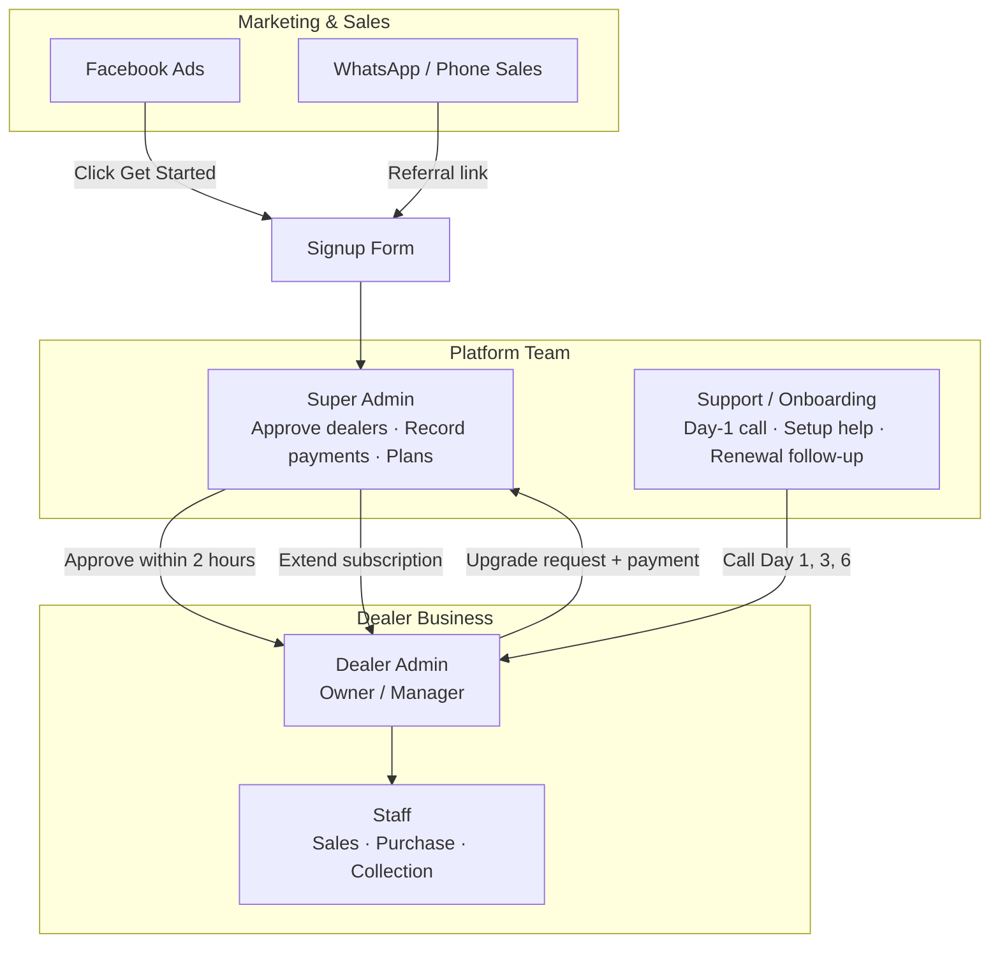
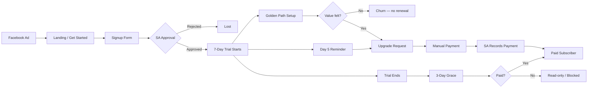
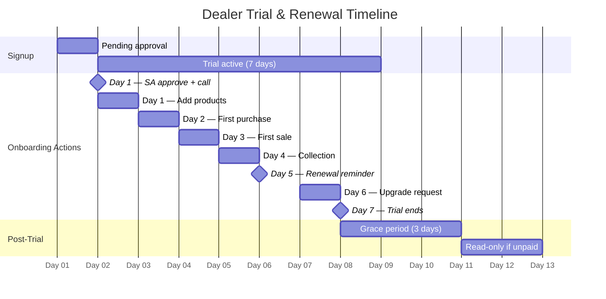
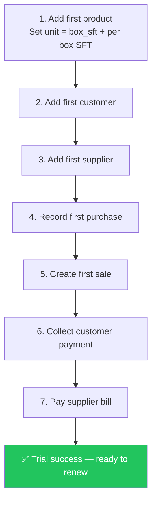
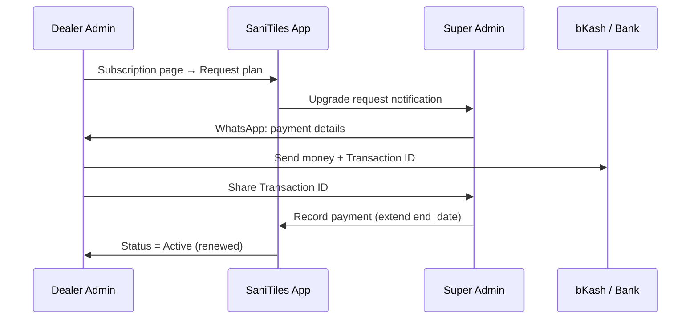
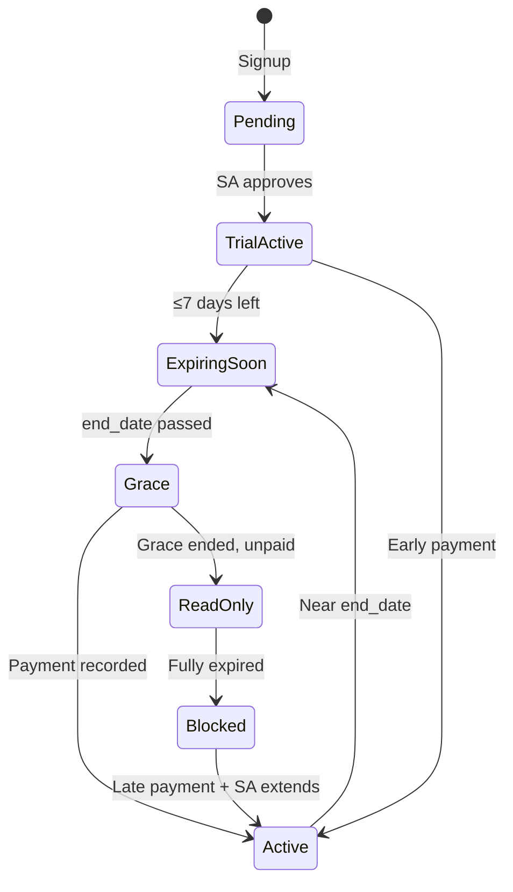

# SaniTiles ERP — Master Plan Organogram

**Version:** 2026-06-25  
**Trial period:** 7 days (updated from 3)  
**Grace period after expiry:** 3 days (unchanged)  
**Purpose:** End-to-end map from Facebook ad → signup → activation → renewal

---

## 1. Team Organogram (Who Does What)



| Role | Responsibility | SLA |
|------|----------------|-----|
| **Super Admin** | Approve pending signups, record bKash/bank payments, extend subscriptions | Approve ≤ **2 hours** (business hours) |
| **Support / Onboarding** | WhatsApp/call new dealers, guide first product + first sale | Contact within **24 hours** of approval |
| **Dealer Admin** | Complete golden-path setup, decide to renew | Complete setup by **Day 5** |
| **Staff** | Daily purchase, sale, collection entry | After admin setup |

---

## 2. Customer Journey (Facebook → Renewal)



---

## 3. Trial Timeline (7 Days)



| Day | System state | Dealer action | Your team action |
|-----|--------------|---------------|------------------|
| **0** | Pending | Submit signup | SA approves ASAP |
| **1** | Trial active | Add products (set SFT per box) | **Call/WhatsApp** — offer setup help |
| **2** | Trial active | Add customer + supplier, record purchase | Check onboarding checklist progress |
| **3** | Trial active | Create first sale or POS invoice | Confirm stock reduced correctly |
| **4** | Trial active | Record customer payment (Collections) | Show due = 0 on invoice |
| **5** | Trial active | Review dashboard & reports | **Send renewal reminder** — 2 days left |
| **6** | Trial active | Submit upgrade request on Subscription page | Share bKash/bank details |
| **7** | Trial ends | Pay + send transaction ID | SA records payment → extend 1 month |
| **8–10** | Grace (3 days) | Full access continues | Follow up if unpaid |
| **11+** | Expired | Read-only or blocked | Win-back call |

---

## 4. Golden Path Onboarding (In-App Checklist)

The dashboard **Onboarding Checklist** tracks these steps — support should guide dealers through them in order:



**Rule:** If a dealer completes steps 1–5 before Day 5, renewal rate improves significantly.

---

## 5. Subscription & Payment Flow



**Payment channels (shown in app):**
- bKash / Nagad: `01674533303`
- Rocket: `016745333033`
- Bank: Pubali Bank — A/C `2706101077904`

---

## 6. Subscription States



| Status | Dealer can enter data? | Banner in app |
|--------|------------------------|---------------|
| Trial / Active | Yes | Green |
| Expiring soon (≤7 days) | Yes | Yellow |
| Grace (3 days after expiry) | Yes | Orange |
| Read-only | No (view only) | Red |
| Blocked | No login | Blocked page |

---

## 7. Facebook Ad → Message Match

What the ad promises must match what happens:

| Ad says | System delivers |
|---------|-----------------|
| "Free trial" | **7 days** after approval |
| "Tiles ERP" | Product setup with **SFT per box** |
| "Easy signup" | Form → wait for approval (set expectation: "Approved within 2 hours") |
| "Manage sales & stock" | Golden path: purchase → sale → stock update |

**Recommended ad copy:**  
*"7-day free trial · Tiles & sanitary ERP · We help you set up your first sale"*

---

## 8. Renewal Playbook (WhatsApp Scripts)

### Day 1 — After approval
> Assalamualaikum [Name] bhai, SaniTiles ERP theke. Apnar account approve hoyeche. Ami 10 minute e phone diye prothom product + sale setup e help korbo. Free trial 7 din.

### Day 5 — Reminder (automated)
System cron sends SMS + email at 9 AM when **2 days remain** on trial.

**SMS (Bangla):**
> [Name], SaniTiles ERP trial — আর ২ দিন বাকি ([Business]). Trial শেষ হওয়ার আগে একটা sale complete করুন।

**Manual trigger:** POST `/api/admin/cron/trial-day5-reminders`

### Day 7 — Last day (automated)
System cron sends SMS + email at 9 AM to dealers whose trial ends today.

**SMS (Bangla):**
> [Name], আজ আপনার SaniTiles ERP trial শেষ ([Business]). Renew করতে bKash/Nagad: 01674533303. Transaction ID পাঠান।

**Manual trigger:** POST `/api/admin/cron/trial-day7-reminders` or run both via `/api/admin/cron/trial-reminders`

**Cron schedule (recommended — runs both):**
```bash
0 9 * * * cd /var/www/tilessaas/backend && npm run cron:trial-reminders
```

### Day 10 — Grace ending
> Grace period ses hocche. Payment na korle account read-only hobe. Sahajjo lagle bolben.

---

## 9. KPIs to Track Weekly

| Metric | Target | Where to check |
|--------|--------|----------------|
| Signups from Facebook | Track in ad manager | Meta Ads |
| Approval time | ≤ 2 hours | Super Admin → Dealers (pending) |
| % completing golden path (≥5 steps) | ≥ 40% | Onboarding counts API / dashboard |
| Trial → paid conversion | ≥ 25% | SA Revenue / Subscriptions |
| Avg days to first sale | ≤ 3 days | Audit logs / onboarding counts |
| Renewal at Day 7 | ≥ 20% | Subscription payments |

---

## 10. Technical Reference (Trial = 7 Days)

| Location | Setting |
|----------|---------|
| `backend/src/lib/trialConstants.ts` | `DEFAULT_SIGNUP_TRIAL_DAYS = 7` |
| `src/lib/trialConstants.ts` | `SIGNUP_TRIAL_DAYS = 7` |
| DB migration `069_trial_days_7` | Updates Free Trial plan |
| Signup provisioning | `authService.register()` uses plan `trial_days` |
| Marketing pages | Landing, Get Started — dynamic from constant |

**Deploy after code change:**
```bash
cd backend && npm run migrate
```

---

## 11. Priority Improvements (Next Phase)

1. **Auto-approve** Facebook signups (or SLA alert if pending > 2h)
2. ~~**Automated SMS** on Day 5 and Day 7 of trial~~ **Done** — `cron:trial-reminders` (Day 5 + Day 7)
3. **bKash merchant API** for one-click renewal (reduce manual step)
4. **In-app video** (Bangla): 5-min "first sale" tutorial
5. **Extend trial** automatically if golden path not started by Day 3

---

*This document is the single source of truth for signup → trial → renewal operations. Update when trial length, grace period, or payment flow changes.*
