# Workflow State Diagrams

**Baseline:** `CURRENT_SYSTEM_AUDIT.md`  
Target document lifecycles for transaction-driven architecture.

---

## 1. Global document states

All financial/inventory documents share this base lifecycle:

```
                    ┌─────────┐
                    │  draft  │  editable, no stock/ledger effect
                    └────┬────┘
                         │ submit
                         ▼
              ┌──────────────────────┐
              │  pending_approval    │  optional; approval hash required
              └──────────┬───────────┘
                         │ approve / auto-approve
                         ▼
                    ┌─────────┐
         ┌─────────│ posted  │─────────┐
         │         └────┬────┘         │
         │ reverse      │              │ (terminal for ops)
         ▼              │ amend = reverse + new draft
    ┌─────────┐         │
    │ reversed│◄────────┘
    └─────────┘
```

**Rules:**
- `posted` → immutable header/lines
- `reversed` → creates inverse posting batch; links `reverses_document_id`
- Amend = new document referencing `amends_document_id`

---

## 2. Purchase workflow

### Current (main)

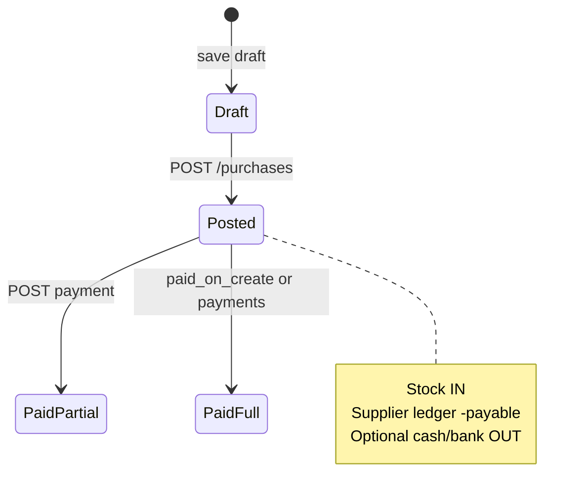

**Gaps:** No GRN checkpoint, no reverse, edit menu was 404.

### Target

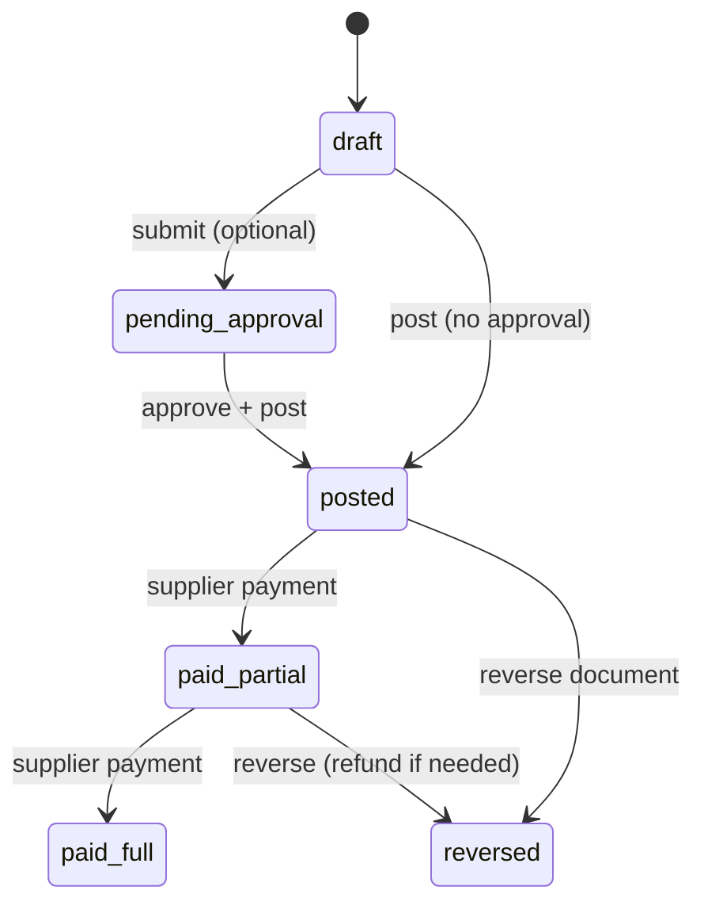

**Bangladesh flow option (Phase 3):**

```
PO draft → posted (order) → GRN posted (qty confirm) → Purchase invoice posted → Payment
```

For MVP: single `posted` purchase (current behavior) + payment states derived from ledger.

---

## 3. Sale / POS workflow

### Current

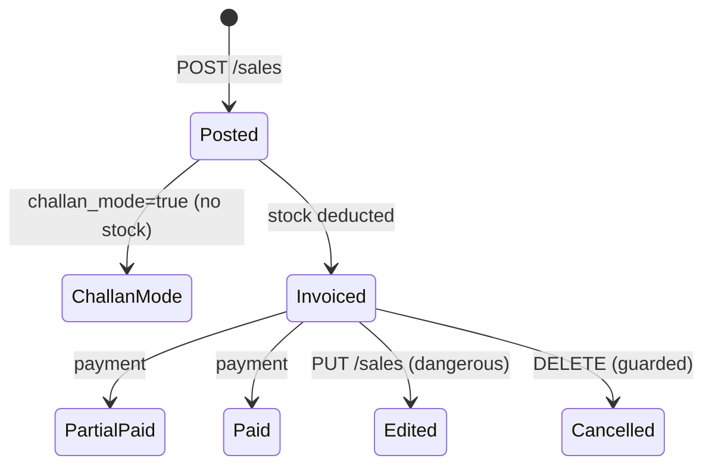

### Target

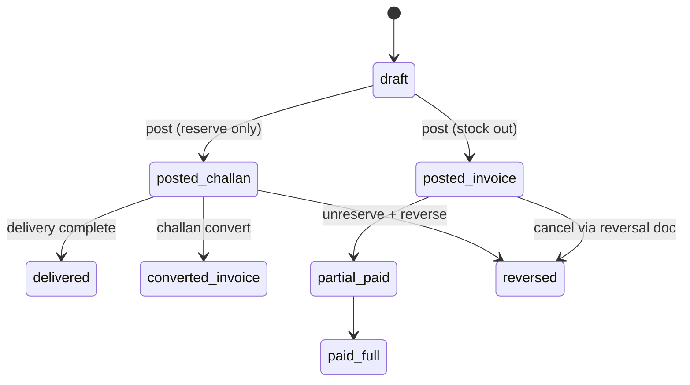

**Payment states** (derived, not stored independently):
- `due_amount = net - allocated_payments` from posting lines

---

## 4. Sales return workflow

### Current

```
POST return → aggregate stock IN → customer refund ledger → optional cash OUT
(no batch restore, no COGS reversal)
```

### Target

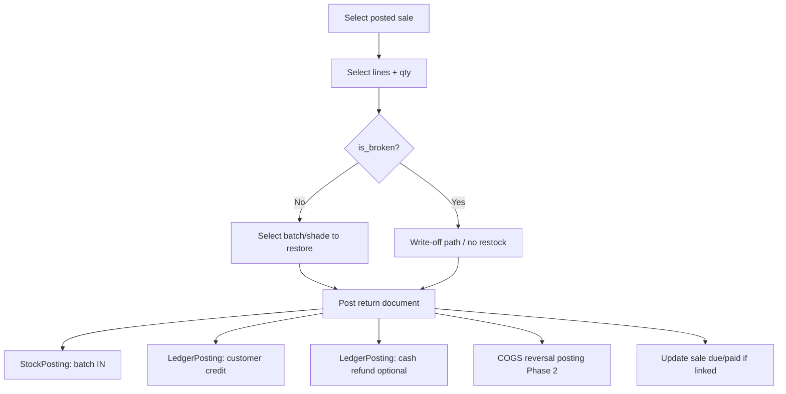

---

## 5. Purchase return workflow

### Target

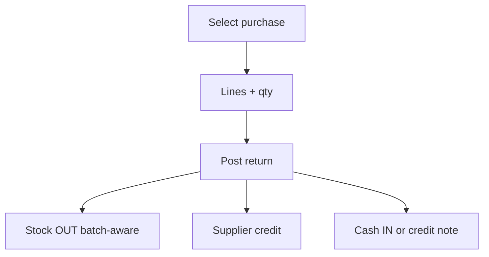

---

## 6. Customer collection workflow

### Current (after Phase 1 fixes on main)

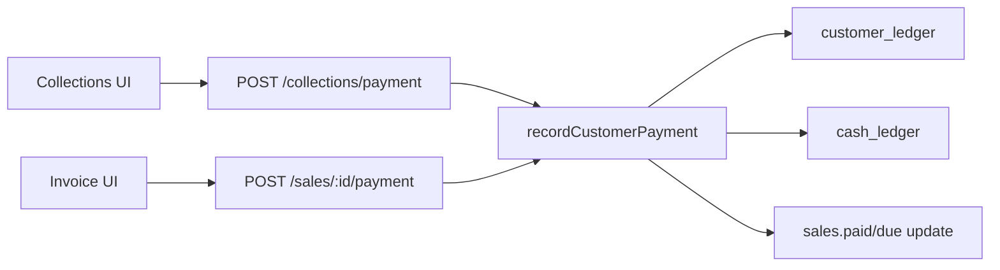

### Target

Same flow, routed through `LedgerPostingEngine.postCustomerReceipt()` with optional bank account and Mushak receipt note.

---

## 7. Supplier payment workflow

### Current (main after workflow restructure Phase 1)

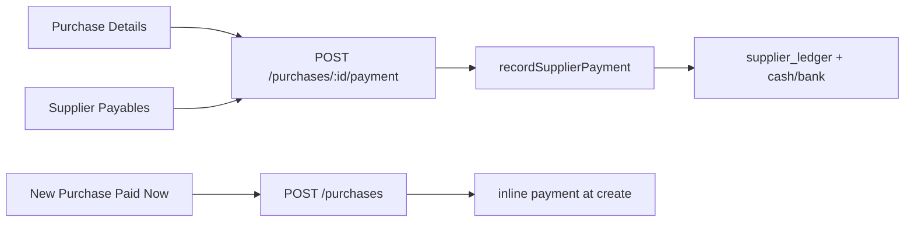

### Target addition (Phase 2)

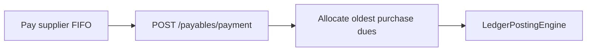

---

## 8. Delivery & fulfillment

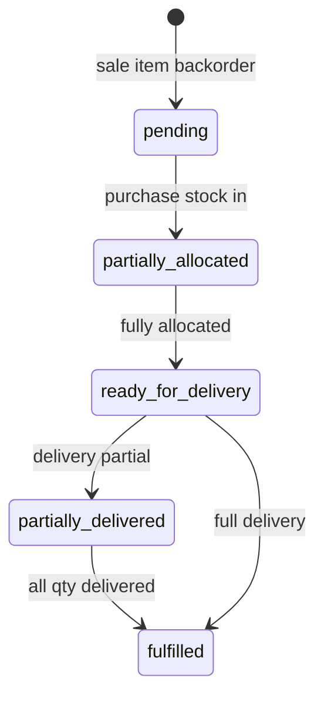

**Note:** Delivery today updates `sale_items.fulfillment_status` only — stock already deducted on invoice post (non-challan). State diagram aligns ops visibility, not second stock hit.

---

## 9. Warehouse transfer

### Current

```
request → approved → received (metadata + transport cost to cash/bank)
NO stock movement between warehouses
```

### Target

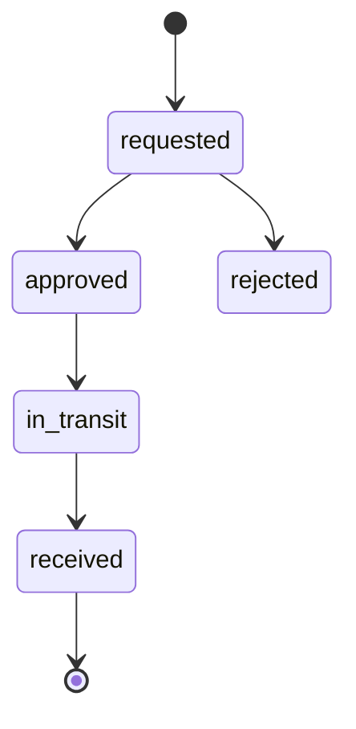

On `received`: `StockPostingEngine.transfer(from_wh, to_wh, batch, qty)`.

---

## 10. Expense workflow

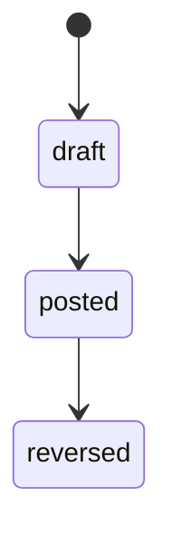

Posted: `expense_ledger` + `cash_ledger` or `bank_ledger`.

---

## 11. Approval checkpoint map

| Document action | Approval type (existing) | Target enforcement |
|-----------------|-------------------------|-------------------|
| Sale with credit override | `credit_override` | Block post until consumed |
| Sale discount over limit | `discount_override` | Block post |
| Backorder sale | `backorder_sale` | Block post |
| Stock adjustment | `stock_adjustment` | Block post |
| Sale cancel | `sale_cancel` | Block reverse |
| Reservation release | `reservation_release` | Block release RPC |

**Target:** `ApprovalService.assertConsumed(type, hash, documentPayload)` inside `PostingOrchestrator` before post.

---

## 12. Audit trace (target)

Every `posted` transition creates:

| Field | Value |
|-------|-------|
| `posting_batch_id` | UUID linking all lines |
| `document_type` | purchase, sale, etc. |
| `document_id` | header id |
| `posted_by` | userId |
| `posted_at` | timestamp |
| `reverses_batch_id` | if reversal |

`audit_logs` references `posting_batch_id` for one-click trace UI.
